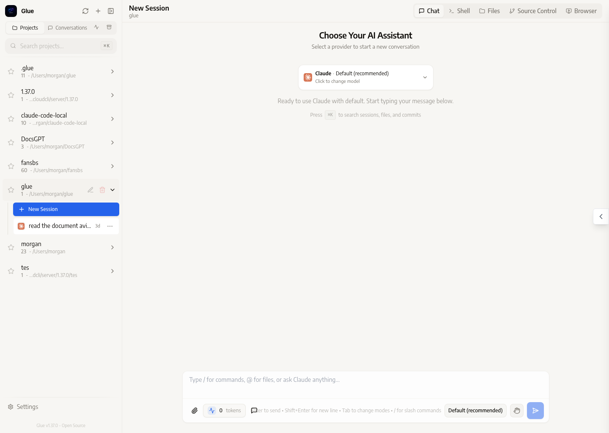
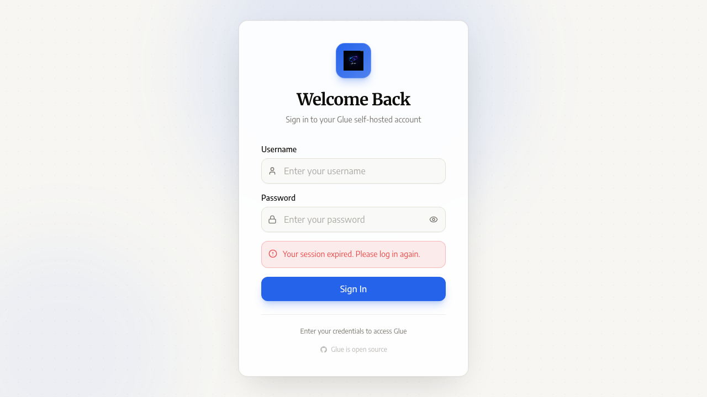

# Glue

<div align="center">
  <p><strong>Run Claude Code locally with your own models.</strong></p>
  <p>Glue is the local-first Claude Code experience with desktop and web UI on Apple Silicon.</p>
  <p>
    
    
    
    
    
    
  </p>
  <p>
    <a href="https://github.com/mmerghani/glue/releases/download/v1.37.0/glue-desktop-1.37.0-mac-arm64.dmg">
      
    </a>
    <a href="https://github.com/mmerghani/glue/releases">
      
    </a>
  </p>
</div>

> First run downloads the selected local model once. The default starter model is about 5GB, and larger models take longer.



## Download the App

- [Download Glue Desktop for macOS (Apple Silicon)](https://github.com/mmerghani/glue/releases/download/v1.37.0/glue-desktop-1.37.0-mac-arm64.dmg)
- [View all releases](https://github.com/mmerghani/glue/releases)

## Before You Start

Glue installs the local runtime during setup, but the AI model itself may still
need to download from Hugging Face the first time you use Glue.

- This first download is normal
- It happens when you first run `glue cli` or `glue ui`
- The default starter model is about `5GB`; larger models take longer
- Each model only downloads once on a machine
- During that first run, Glue is preparing the local model on your machine

## The Problem

Today, there are two strong pieces in the open-source ecosystem, but they do not become a smooth product on their own:

- `claude-code-local` proves that Claude Code can run against local models
- CloudCLI / ClaudeCodeUI proves that agent workflows can have a polished desktop-style GUI

The gap is the product experience between them.

Most developers do not want to manually wire a local inference server, environment variables, model selection, launch scripts, and a GUI runtime just to get a usable local coding assistant.

## What Glue Solves

Glue is the thin layer that makes that stack usable.

It gives you:

- **`glue cli`** for terminal Claude Code in any project folder
- **`glue ui`** for the local GUI flow
- **Glue Desktop** with auto-starting local backend behavior
- **A thin bootstrap installer** instead of a deep fork of every dependency
- **A local-first workflow** where your code and prompts can stay on your machine

## What Works Today

Glue now supports a real end-to-end local workflow:

- model selection from the `claude-code-local` source-of-truth catalog
- reusable local backend startup on `127.0.0.1:8000`
- desktop auto-start of the model backend when needed
- direct launch into Local Glue without the old hanging startup screen
- a rebranded desktop app built from the CloudCLI UI base
- a thin installer that sets up the launcher and upstream runtime cleanly

## Why Glue Exists

Glue is not trying to replace upstream projects.
It exists to connect them with the minimum amount of new surface area.

That means:

- keep `claude-code-local` as the source of truth for local model runtime behavior
- keep the desktop shell/UI close to upstream CloudCLI structure where possible
- focus Glue changes on launch flow, local integration, packaging, and visible product identity

This makes the project easier to maintain while still solving a real usability problem.

## Screenshots

### New Session


### Login



## Quick Start

### Clone the repo

```bash
git clone https://github.com/mmerghani/glue.git ~/glue
cd ~/glue
./install.sh
```

> First run downloads the selected local model once. The default starter model is about 5GB, and larger models take longer.

### Or download the source ZIP

1. Download and extract the repository ZIP from GitHub
2. Open Terminal in the extracted folder
3. Run:

```bash
./install.sh
```

The installer will:

- install or reuse Homebrew, Git, Node.js, and Claude Code CLI
- clone or refresh `~/claude-code-local`
- run upstream `claude-code-local/install.sh`
- install the maintained Glue launcher into `~/.glue/glue`
- link `glue` into your PATH

After install, the first run of `glue cli` or `glue ui` may still need to
download the selected model from Hugging Face. That is expected on a new machine.

## Daily Use

Run Claude Code in the current directory:

```bash
glue cli
```

Open the local GUI flow:

```bash
glue ui
```

## Desktop Build

If you want to build the macOS desktop package locally:

```bash
cd glue-source
npm install
npm run desktop:dist:mac
```

Artifacts are written to:

- `glue-source/release/desktop/glue-desktop-<version>-mac-arm64.dmg`
- `glue-source/release/desktop/mac-arm64/Glue.app`

## Product Positioning

Glue offers:

- **Local-first coding assistant workflow**
- **CLI and GUI entry points**
- **Lower ongoing cost than hosted-only coding agents**
- **More privacy and control for developers who want local execution**
- **A better out-of-the-box experience than manually combining the pieces yourself**

In short:

> Glue connects the best open local-agent building blocks into a usable product.

## Architecture

Glue currently has three main layers:

1. **`claude-code-local`**
   The local model runtime and Claude Code compatibility layer.
2. **Glue launcher + installer**
   The thin bootstrap that makes CLI and GUI flows usable.
3. **Glue Desktop / UI**
   The rebranded CloudCLI-based shell and local desktop experience.

Glue intentionally stays thin and delegates local model serving to upstream `claude-code-local`.

## Project Layout

- `install.sh` - thin bootstrap installer
- `launchers/glue` - maintained launcher source
- `glue-source/` - desktop/web app source
- `docs/release-checklist.md` - release checklist
- `glue idea.md` - product/positioning note updated to the current achieved state

## Known Limitations

- supported path today is **macOS on Apple Silicon**
- local model serving depends on upstream `claude-code-local` and `vllm-mlx`
- the packaged app is **not code signed or notarized yet**
- first-run model startup can take longer when a model needs download or memory warmup
- public release automation is still simpler than a polished consumer-grade release pipeline

## Roadmap

Near-term priorities:

- polish the public release flow
- improve first-run onboarding for new users
- tighten installer and release automation further
- continue staying close to upstream dependencies while improving local UX

## Why This Repo Matters

This repo is not just another fork.
It is the product layer on top of proven open-source components.

If you wanted:

- Claude Code style workflows
- local inference
- a desktop UI
- fewer moving pieces to wire by hand

that is exactly the problem Glue is solving.

## Thank You

Glue stands on the work of open-source projects that made this possible:

- [`claude-code-local`](https://github.com/nicedreamzapp/claude-code-local) for proving the local Claude Code runtime path
- [CloudCLI / ClaudeCodeUI](https://github.com/siteboon/claudecodeui) for the desktop and web UI base that Glue rebrands and integrates
- `vllm-mlx` and the local Apple Silicon inference ecosystem that make practical on-device serving possible
- The [Hugging Face](https://huggingface.co/) community and model publishers who distribute the local models this workflow depends on
